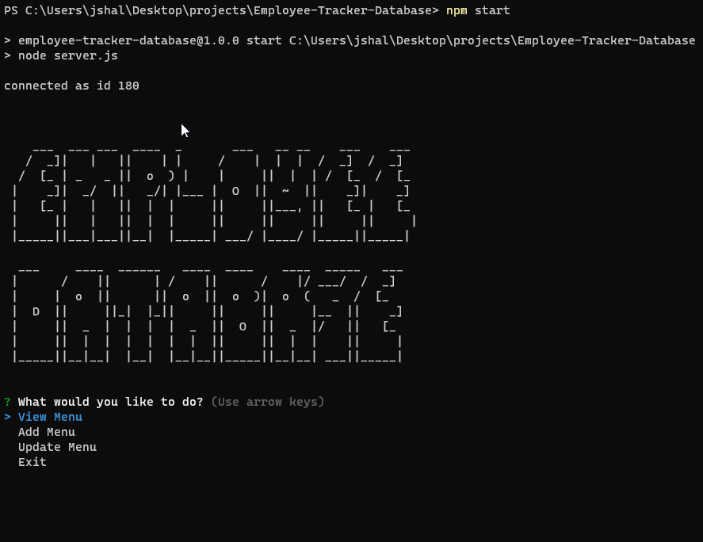

# Employee-Tracker-Database
# University of Toronto Coding BootCamp Challenge Week 12 -  SQL

## Grading Requirements
--- 
Below is the link to the video of the working application.   

You Tube link:(https://youtu.be/jPsJhftjQL0) 

 

## Repository
---  
https://github.com/jshallcross/Employee-Tracker-Database

## Questions
---   
Any questions can be directed to jshallcross1@icloud.com
